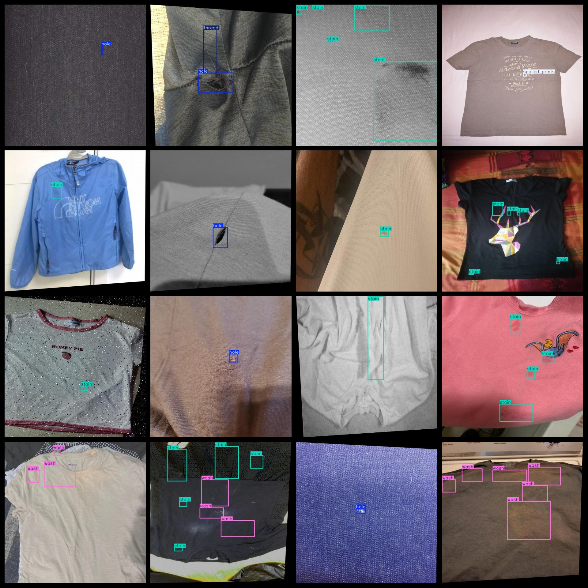
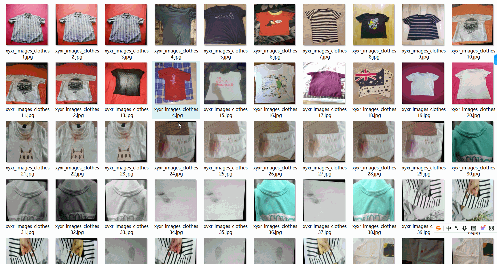

# [Object Detection] Clothing Defect Dataset 3577 imagesYOLO+VOC format

[Object Detection] Clothing Defect Dataset 3577 images in both YOLO and VOC formats.

The dataset is organized into three folders: JPEGImages, Annotations, and labels. The JPEGImages folder contains a total of 3577 JPEG images, the Annotations folder contains a total of 3577 XML files, and the labels folder contains a total of 3577 txt files.

The number of JPEG images in the JPEGImages folder is 3577.

The number of XML files in the Annotations folder is also 3577.

The number of txt files in the labels folder is also 3577.

There are a total of 6 label categories: "hole", "lint", "spoiled_prints", "stain", "thread", "wash".

The corresponding English names for each label category are as follows: ["Kong", "Cotton Fabric", "Damaged Printing", "Stains", "Thread", "Washing"].

The number of bounding boxes (note that the order in the YOLO format is different from this, but it matches the classes.txt file in the labels folder) for each label category is as follows:

- Hole: 1395
- Lint: 446
- Spoiled_prints: 102
- Stain: 8186
- Thread: 479
- Wash: 1428

Total number of bounding boxes: 12036.

The image resolution is clear.

The images have been enhanced.

The shape of the labels is a rectangular box, used for target detection recognition.

Important Note: No guarantees are made regarding the accuracy or weights of the models trained on this dataset. The dataset only provides accurate and reasonable annotations.

Annotation and image details are as follows:
## Images

---

Here is a pay link on Stripe (https://buy.stripe.com/3cs8yP7sY87d0vu9AB). Please contact me lonlonago@foxmail.com after funding $89, and I will send you a complete data files, thank you!

